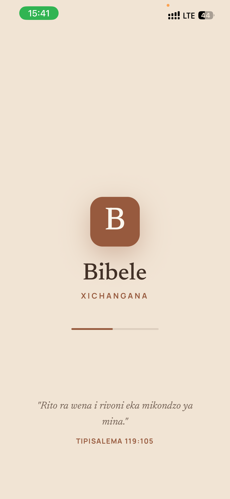
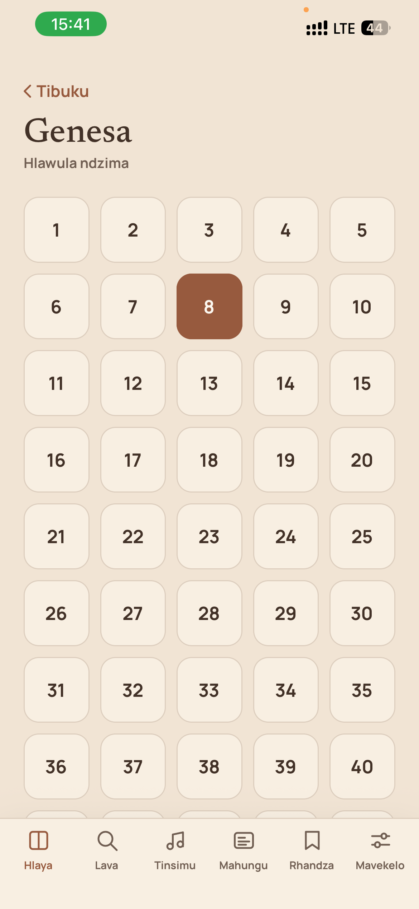
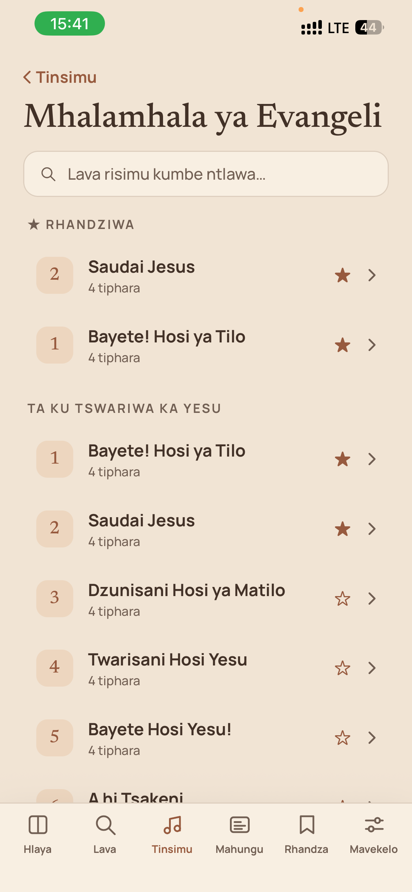
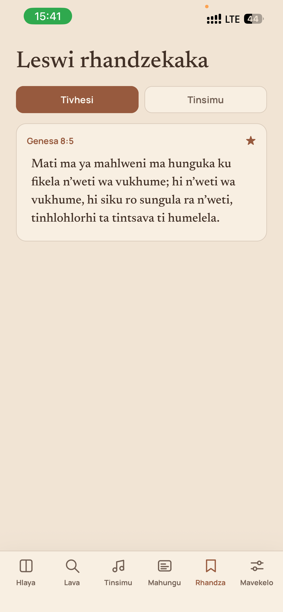
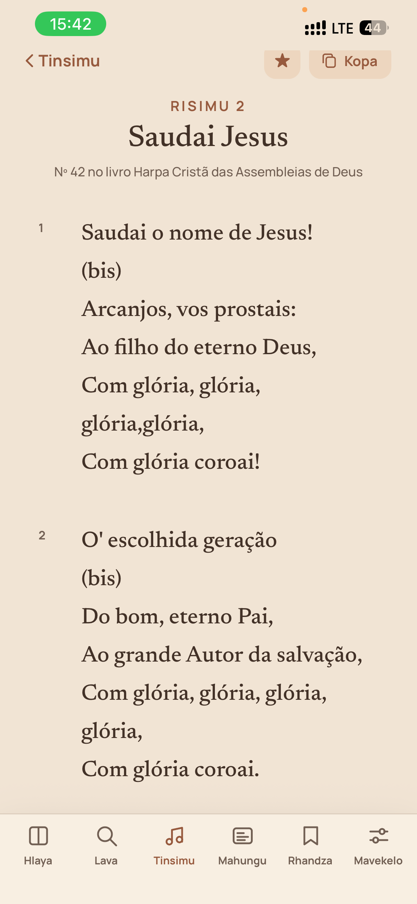
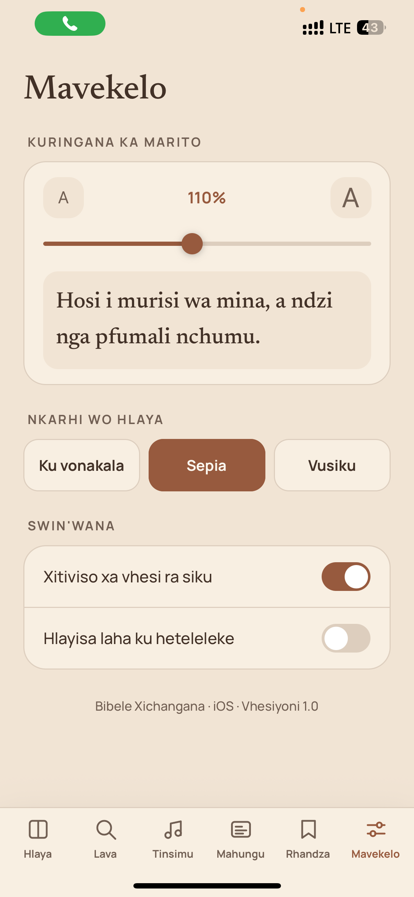

# Bibele Xichangana

Aplicação móvel da Bíblia em **Xichangana**, construída com **Expo + React Native + TypeScript**, com um design *nude*, sereno e minimalista. Inclui os 66 livros da Bíblia, hinários de cânticos com categorias e favoritos, pesquisa por texto, leitura em voz alta e três temas de leitura.

## Capturas de ecrã

| Abertura | Capítulos | Cânticos |
|---|---|---|
|  |  |  |

| Favoritos | Detalhe do cântico | Definições |
|---|---|---|
|  |  |  |

## Funcionalidades

- **Bíblia completa** — os 66 livros (Antigo e Novo Testamento) com nomes em Xichangana, organizados por livro → capítulo → versículo. O texto real é adicionado progressivamente por livro (ver [Conteúdo bíblico](#conteúdo-bíblico) abaixo); os capítulos ainda não preenchidos usam um texto de exemplo como reserva, para a app nunca ficar vazia.
- **Leitura** — cabeçalho flutuante que se esconde ao descer o texto e reaparece ao subir o scroll; tamanho de letra ajustável; três temas (Claro, Sépia, Vusiku/escuro).
- **Destacar e copiar versículos** — 5 cores de destaque, cópia formatada com referência incluída.
- **Favoritos** — versículos e cânticos podem ser marcados com estrela; o separador "Rhandza" mostra os dois tipos num único sítio (com chips para alternar), e a lista de cânticos de cada hinário mostra uma secção "★ Rhandziwa" fixa no topo para acesso rápido.
- **Leitura em voz alta** — narra o versículo actual usando o sintetizador de voz do telefone (`expo-speech`), com play/pausa, avançar/recuar versículo e velocidade ajustável. Se existirem gravações reais registadas em `src/audioManifest.ts`, essas têm sempre prioridade sobre a voz sintetizada.
- **Pesquisa** — por título de livro e por palavras dentro do texto de qualquer versículo já preenchido.
- **Hinários (Tinsimu)** — suporta múltiplos hinários (ex. *Mhalamhala ya Evangeli*); cada cântico tem categoria, citação bíblica, sigla do autor/fonte, referência cruzada a outro hinário e a "toada" (melodia emprestada), quando aplicável.
- **Última posição de leitura** — a grelha de capítulos de um livro destaca automaticamente o último capítulo lido.
- **Notícias (Mahungu)** — separador para anúncios/novidades.
- Tudo é guardado localmente no dispositivo (`AsyncStorage`) — favoritos, destaques, tema e progresso de leitura sobrevivem a reinícios da app.

## Stack técnica

- [Expo](https://expo.dev) SDK 54 + React Native 0.81 + React 19, em TypeScript.
- [NativeWind](https://www.nativewind.dev/) (Tailwind CSS para React Native) para estilos.
- [React Navigation](https://reactnavigation.org/) (bottom tabs + native stacks aninhados).
- `expo-audio` / `expo-speech` — reprodução de áudio real e texto-para-voz.
- `expo-haptics`, `expo-clipboard`, `expo-font`, `@react-native-async-storage/async-storage`.
- `react-native-reanimated` / `react-native-worklets`, `react-native-gesture-handler`, `react-native-svg`, `react-native-screens`, `react-native-safe-area-context`.

## Como correr

```bash
npm install
npx expo start
```

Lê o QR code com a app **Expo Go** (iOS/Android), ou pressiona `i` / `a` no terminal para abrir num simulador/emulador.

### Gerar um build standalone (EAS Build)

```bash
npx eas-cli login
npx eas-cli build --platform android --profile preview   # gera um .apk instalável
```

O perfil `preview` em [`eas.json`](eas.json) está configurado para gerar `.apk` directamente; o perfil `production` gera `.aab` para submissão à Play Store.

## Estrutura do projeto

```
App.tsx                    Navegação (splash → tabs → stacks) + carregamento de fontes
src/
  types.ts                 Tipos partilhados (Book, Verse, Hymn, Theme, param lists de navegação)
  theme.tsx                Temas (Claro/Sépia/Vusiku) + provider persistido
  library.tsx               Destaques, favoritos (versículos e cânticos) e última posição de leitura
  data.ts                   Lista dos 66 livros, gerador de reserva e índice de pesquisa
  bible/<livro>.ts          Um ficheiro por livro da Bíblia, com os capítulos reais já preenchidos
  hymns.ts                  Registo dos hinários (HYMNALS) e agregador dos cânticos (HYMNS)
  hymnals/<hinário>.ts      Um ficheiro por hinário, com os seus cânticos
  audioManifest.ts          Registo opcional de ficheiros de áudio reais por versículo
  ui.tsx                    Componentes partilhados (Touchable, Slider, sombras por plataforma)
  icons.tsx                 Ícones SVG
  TabBar.tsx                Barra de separadores personalizada
  screens/*.tsx             Splash, Books, Chapters, Reader, Audio, Search, Hymnals, Songs,
                             SongDetail, News, Favorites, Settings
```

### Conteúdo bíblico

Cada livro tem o seu próprio ficheiro em `src/bible/`, no formato:

```ts
import type { Verse } from '../types';

export const NOME_DO_LIVRO_CHAPTERS: Record<number, Verse[]> = {
  1: [
    { n: 1, text: '...' },
    { n: 2, text: '...' },
  ],
};
```

Basta preencher o `Record` com os capítulos reais — `data.ts` liga automaticamente qualquer livro preenchido à leitura, à pesquisa e ao índice, sem precisar de alterações adicionais.

### Hinários

Cada hinário tem o seu ficheiro em `src/hymnals/`, exportando um array de `Hymn` (título, categoria, estrofes, e opcionalmente `scripture`, `refs`, `tune`, `attribution`). Para acrescentar um hinário novo, regista-o em `HYMNALS` dentro de `src/hymns.ts` e junta o seu array ao `HYMNS`.

### Áudio real

Para usar gravações reais em vez da voz sintetizada, regista-as em `src/audioManifest.ts`:

```ts
export const AUDIO: Record<string, AudioSource> = {
  '0-1-1': require('./assets/audio/ge-1-1.mp3'), // chave = "<índice do livro>-<capítulo>-<versículo>"
  '0-1-2': { uri: 'https://cdn.exemplo.org/xi/ge-1-2.mp3' }, // ou streaming
};
```

Versículos sem entrada aqui continuam a funcionar através da leitura em voz alta.
